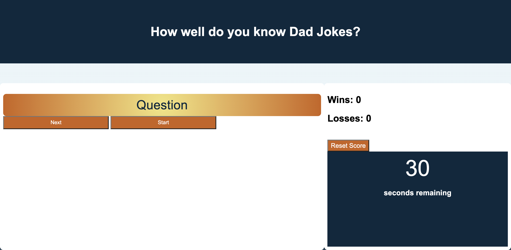

# 04-Code-Quiz
## How Well Do You Know Dad Jokes?

## Description
This Repository will create a Web API Code Quiz.  I attempted to make a web quiz about "Dad Jokes".  We tell them often in our house, do you?  The quiz has 10 questions with three possible answers.  The user can click on the answer the user believes to be correct.  It will then record whether their answer is correct.  If it is not correct, it will record as Incorrect and deduct 5 seconds from your time remaining.  The game is over when the time is over.  The amount of correct and incorrect answers will then be logged into the console.  

## Table of Contents
1. Title
2. Questions
3. Possible answer buttons once the game is initiated
4. Next question button
5. Start button
6. Countdown timer
7. Records Correct and incorrect

##  How to Run the Project
Once the page loads and you are ready for the "oh so bad they are funny" jokes, click on the Start button.  Read through the question and answers.  Select the answer you feel is correct.  Then select Next.  Game is over when time alloted has ran down to 0.  

## Screenshot

## Credits
I had lots of help from my tutor as well as using the CSS template from the Unit 4 Web API's Activity 28 Mini-project.  

## Links
[Website] https://canro2b.github.io/04-Code-Quiz/
[GitHub] https://github.com/CanRo2B/04-Code-Quiz
